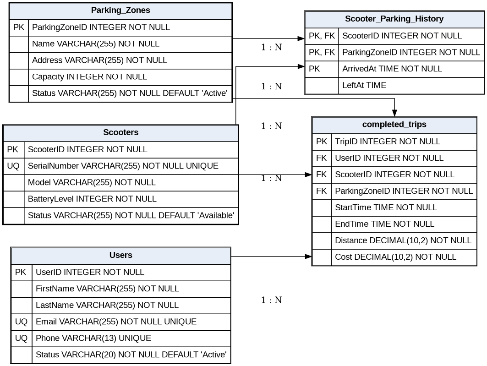

# Отчёт

## Part 1: Выбор Сценария

Сервис аренды электросамокатов: Отслеживание пользователей, самокатов, парковочных зон и совершенных поездок.

## Part 2: Проектирование Базы Данных и Документация

### Идентификация Сущностей и Атрибутов

1. Пользователи (Users)
2. Самокаты (Scooters)
3. Парковочные зоны (Parking zones)
4. Совершенные поездки (completed_trips)
5. Историю нахождения самокатов (Scooter_Parking_History)

### Проектирование Таблиц

#### 1. Table Name: Users

**Description:** Хранит информацию о зарегистрированных пользователях сервиса аренды электросамокатов.

**Attributes:**
```
UserID: INTEGER, PK, NOT NULL
FirstName: VARCHAR(255), NOT NULL
LastName: VARCHAR(255), NOT NULL
Email: VARCHAR(255), NOT NULL, UNIQUE
Phone: VARCHAR(13), UNIQUE
Status: VARCHAR(20), NOT NULL, DEFAULT 'Active'
```

**Constraints:**
```
PK_Users: PRIMARY KEY (UserID)
UQ_Users_Email: UNIQUE (Email)
UQ_Users_Phone: UNIQUE (Phone)
CHK_Users_Status: CHECK (Status IN ('Active', 'Blocked'))
```

#### 2. Table Name: Scooters

**Description:** Содержит информацию об электросамокатах, используемых в системе аренды.

**Attributes:**
```
ScooterID: INTEGER, PK, NOT NULL
SerialNumber: VARCHAR(255), NOT NULL, UNIQUE
Model: VARCHAR(255), NOT NULL
BatteryLevel: INTEGER, NOT NULL
Status: VARCHAR(255), NOT NULL, DEFAULT 'Available'
```

**Constraints:**
```
PK_Scooters: PRIMARY KEY (ScooterID)
UQ_Scooters_SerialNumber: UNIQUE (SerialNumber)
CHK_Scooters_Battery: CHECK (BatteryLevel >= 0 AND BatteryLevel <= 100)
CHK_Scooters_Status: CHECK (Status IN ('Available', 'In Use', 'Maintenance', 'Unavailable'))
```

#### 3. Table Name: Parking_Zones

**Description:** Содержит информацию о парковочных зонах, предназначенных для размещения электросамокатов.

**Attributes:**
```
ParkingZoneID: INTEGER, PK, NOT NULL
Name: VARCHAR(255), NOT NULL
Address: VARCHAR(255), NOT NULL
Capacity: INTEGER, NOT NULL
Status: VARCHAR(255), NOT NULL, DEFAULT 'Active'
```

**Constraints:**
```
PK_ParkingZones: PRIMARY KEY (ParkingZoneID)
CHK_ParkingZones_Capacity: CHECK (Capacity > 0)
CHK_ParkingZones_Status: CHECK (Status IN ('Active', 'Closed', 'Maintenance'))
```

#### 4. Table Name: completed_trips

**Description:** Хранит информацию о завершённых поездках пользователей на электросамокатах. Также реализует связь многие-ко-многим между пользователями и самокатами.

**Attributes:**
```
TripID: INTEGER, PK, NOT NULL
UserID: INTEGER, FK (REFERENCES Users), NOT NULL
ScooterID: INTEGER, FK (REFERENCES Scooters), NOT NULL
ParkingZoneID: INTEGER, FK (REFERENCES Parking_Zones), NOT NULL
StartTime: TIME, NOT NULL
EndTime: TIME, NOT NULL
Distance: DECIMAL(10,2), NOT NULL
Cost: DECIMAL(10,2), NOT NULL
```

**Constraints:**
```
PK_CompletedTrips: PRIMARY KEY (TripID)
FK_CompletedTrips_Users: FOREIGN KEY (UserID) REFERENCES Users(UserID)
FK_CompletedTrips_Scooters: FOREIGN KEY (ScooterID) REFERENCES Scooters(ScooterID)
FK_CompletedTrips_ParkingZones: FOREIGN KEY (ParkingZoneID) REFERENCES Parking_Zones(ParkingZoneID)
CHK_CompletedTrips_Dates: CHECK (EndTime > StartTime)
CHK_CompletedTrips_Distance: CHECK (Distance >= 0)
CHK_CompletedTrips_Cost: CHECK (Cost >= 0)
```

#### 5. Table Name: Scooter_Parking_History

**Description:** Таблица для реализации связи многие-ко-многим между электросамокатами и парковочными зонами. Хранит историю нахождения самокатов в различных парковочных зонах.

**Attributes:**
```
ScooterID: INTEGER, PK, FK (REFERENCES Scooters), NOT NULL
ParkingZoneID: INTEGER, PK, FK (REFERENCES Parking_Zones), NOT NULL
ArrivedAt: TIME, PK, NOT NULL
LeftAt: TIME
```

**Constraints:**
```
PK_ScooterParkingHistory: PRIMARY KEY (ScooterID, ParkingZoneID, ArrivedAt)
FK_ScooterParkingHistory_Scooters: FOREIGN KEY (ScooterID) REFERENCES Scooters(ScooterID)
FK_ScooterParkingHistory_ParkingZones: FOREIGN KEY (ParkingZoneID) REFERENCES Parking_Zones(ParkingZoneID)
CHK_ScooterParkingHistory_Dates: CHECK (LeftAt IS NULL OR LeftAt > ArrivedAt)
```

### Взаимосвязи

**Users и completed_trips (Один-ко-Многим):** Один пользователь может совершить множество поездок, но каждая завершённая поездка относится к одному конкретному пользователю.
`completed_trips.UserID` является внешним ключом, ссылающимся на `Users.UserID`.

**Parking_Zones и completed_trips (Один-ко-Многим):** Одна парковочная зона может быть связана со множеством завершённых поездок, но каждая поездка относится к одной конкретной парковочной зоне.
`completed_trips.ParkingZoneID` является внешним ключом, ссылающимся на `Parking_Zones.ParkingZoneID`.

**Scooters и completed_trips (Один-ко-Многим):** Один самокат может использоваться во множестве поездок, но каждая поездка выполняется на одном конкретном самокате.
`completed_trips.ScooterID` является внешним ключом, ссылающимся на `Scooters.ScooterID`.

**Scooters и Scooter_Parking_History (Один-ко-Многим):** Один самокат может иметь множество записей истории нахождения в парковочных зонах, но каждая запись истории относится к одному конкретному самокату.
`Scooter_Parking_History.ScooterID` является внешним ключом, ссылающимся на `Scooters.ScooterID`.

**Parking_Zones и Scooter_Parking_History (Один-ко-Многим):** Одна парковочная зона может содержать множество самокатов и, соответственно, иметь множество записей истории их нахождения, но каждая запись истории относится к одной конкретной парковочной зоне.
`Scooter_Parking_History.ParkingZoneID` является внешним ключом, ссылающимся на `Parking_Zones.ParkingZoneID`.

**Scooters и Parking_Zones (Многие-ко-Многим):** Один самокат может находиться в различных парковочных зонах в разное время, а одна парковочная зона может использоваться множеством самокатов. Связь реализуется через промежуточную таблицу `Scooter_Parking_History`.
`Scooter_Parking_History.ScooterID` является внешним ключом, ссылающимся на `Scooters.ScooterID`.
`Scooter_Parking_History.ParkingZoneID` является внешним ключом, ссылающимся на `Parking_Zones.ParkingZoneID`.

**Users и Scooters (Многие-ко-Многим):** Один пользователь может совершить поездки на разных самокатах, а один самокат может использоваться разными пользователями. Связь реализуется через таблицу `completed_trips`.
`completed_trips.UserID` является внешним ключом, ссылающимся на `Users.UserID`.
`completed_trips.ScooterID` является внешним ключом, ссылающимся на `Scooters.ScooterID`.

**Нормализация до третьей нормальной формы (3НФ):** Все таблицы имеют атомарные значения и соответствуют первой нормальной форме. Во второй нормальной форме отсутствуют частичные зависимости неключевых атрибутов от составного первичного ключа. В третьей нормальной форме неключевые атрибуты не зависят транзитивно от первичного ключа: данные о пользователях, самокатах и парковочных зонах хранятся в отдельных таблицах, а связи между сущностями реализованы через внешние ключи. Это уменьшает дублирование данных и предотвращает аномалии вставки, обновления и удаления.

## Part 3: ER-Диаграмма


